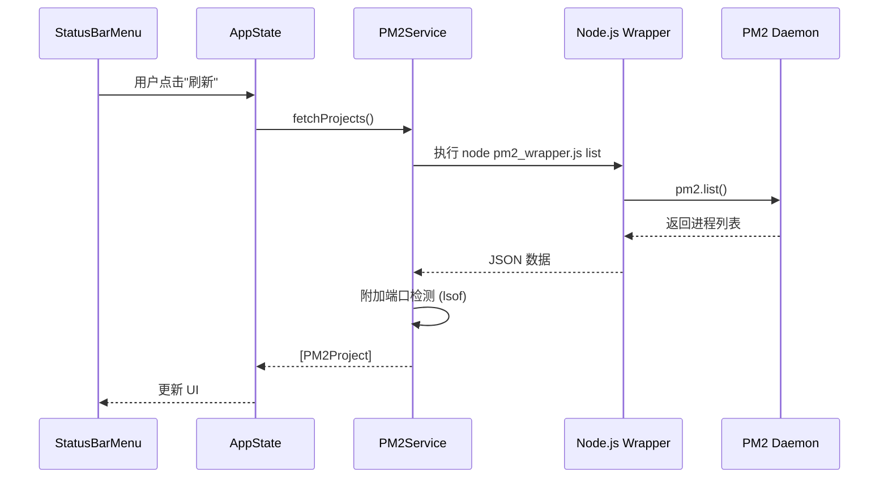
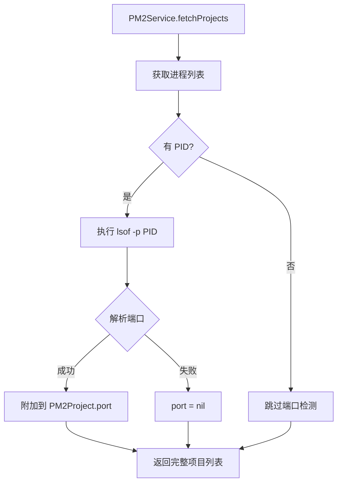
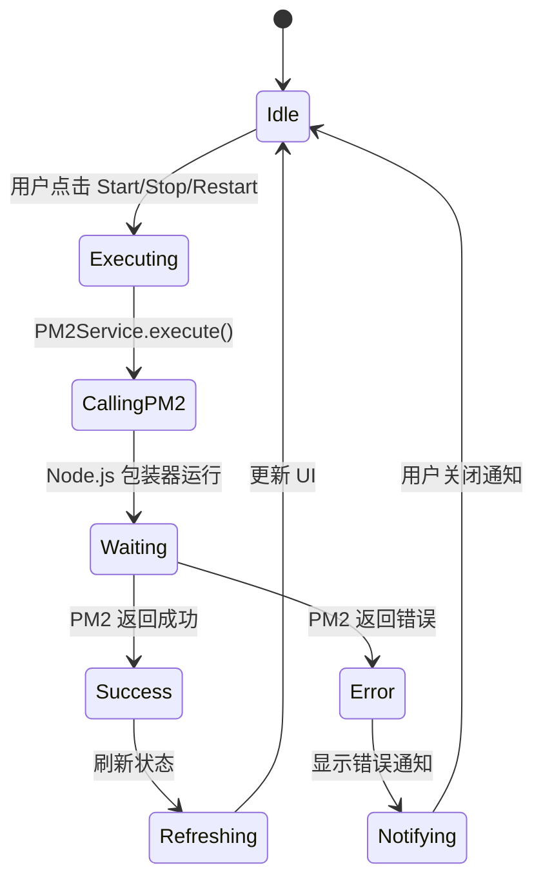

# Visual PM2 GUI - 技术设计文档

> **详细技术规范** | 架构决策、API 设计、数据流

---

## 📐 系统架构

### 分层架构

```
┌─────────────────────────────────────────────────────────┐
│                    Presentation Layer                    │
│  ┌──────────────┐  ┌──────────────┐  ┌──────────────┐  │
│  │ StatusBarMenu│  │ ProjectView  │  │ SettingsView │  │
│  └──────────────┘  └──────────────┘  └──────────────┘  │
└───────────────────────────┬─────────────────────────────┘
                            │
┌───────────────────────────┴─────────────────────────────┐
│                     Business Layer                       │
│  ┌──────────────┐  ┌──────────────┐  ┌──────────────┐  │
│  │ AppState     │  │ PM2Service   │  │ PortManager  │  │
│  └──────────────┘  └──────────────┘  └──────────────┘  │
└───────────────────────────┬─────────────────────────────┘
                            │
┌───────────────────────────┴─────────────────────────────┐
│                      Data Layer                          │
│  ┌──────────────┐  ┌──────────────┐  ┌──────────────┐  │
│  │ PM2Process   │  │ PortPool     │  │ AppConfig    │  │
│  └──────────────┘  └──────────────┘  └──────────────┘  │
└───────────────────────────┬─────────────────────────────┘
                            │
┌───────────────────────────┴─────────────────────────────┐
│                   Infrastructure                         │
│  ┌──────────────┐  ┌──────────────┐  ┌──────────────┐  │
│  │ Node.js API  │  │ lsof         │  │ FileSystem   │  │
│  └──────────────┘  └──────────────┘  └──────────────┘  │
└─────────────────────────────────────────────────────────┘
```

---

## 🔄 数据流设计

### 1. 服务状态同步流程



### 2. 端口检测流程



### 3. 服务操作流程



---

## 📡 API 设计

### PM2Service API

```swift
// MARK: - Core API
protocol PM2ServiceProtocol {
    // 获取所有服务
    func fetchProjects() async throws -> [PM2Project]
    
    // 服务操作
    func startProject(_ id: String) async throws
    func stopProject(_ id: String) async throws
    func restartProject(_ id: String) async throws
    func deleteProject(_ id: String) async throws
    
    // 日志操作
    func fetchLogs(for id: String, lines: Int) async throws -> String
    func streamLogs(for id: String) -> AsyncThrowingStream<String, Error>
    
    // 系统操作
    func flushLogs() async throws
    func reloadPM2() async throws
    func savePM2Config() async throws
}

// MARK: - Helper API
extension PM2Service {
    // 端口检测
    func detectPort(pid: Int) -> Int?
    
    // 服务过滤
    func filterProjects(by category: ServiceCategory) -> [PM2Project]
    func searchProjects(by text: String) -> [PM2Project]
    
    // 批量操作
    func startAllProjects() async throws
    func stopAllProjects() async throws
    func restartAllProjects() async throws
}
```

### Node.js Wrapper API

```javascript
// scripts/pm2_wrapper.js

// 命令行接口
// node pm2_wrapper.js <command> [args...]

// 支持的命令：
// - list: 获取所有服务
// - start <id>: 启动服务
// - stop <id>: 停止服务
// - restart <id>: 重启服务
// - delete <id>: 删除服务
// - logs <id> [lines]: 获取日志
// - flush: 清空日志
// - save: 保存配置

// 输出格式：
// 成功：stdout 输出 JSON
// 失败：stderr 输出 JSON { error: "message" }

// 示例：
// node pm2_wrapper.js list
// → [{"id":"xm-console-api","name":"xm-console-api",...}]
```

---

## 💾 数据模型详细设计

### PM2Process（完整定义）

```swift
struct PM2Project: Identifiable, Codable, Equatable {
    // MARK: - 核心标识
    let id: String                  // PM2 进程名称（唯一）
    let name: String                // 显示名称（可本地化）
    let pid: Int?                   // 进程 ID（可能为 nil）
    
    // MARK: - 状态信息
    let status: ProcessStatus       // online, stopped, errored, etc.
    let cpu: Double                 // CPU 使用率 (0-100)
    let memory: Double              // 内存使用（MB）
    let uptime: TimeInterval        // 运行时长（秒）
    let restarts: Int               // 重启次数
    
    // MARK: - 网络信息
    let port: Int?                  // 监听端口（从 lsof 探测）
    let url: String?                // 访问 URL
    let host: String?               // 主机名（默认 localhost）
    
    // MARK: - 日志信息
    let logPath: String?            // 错误日志路径
    let outPath: String?            // 输出日志路径
    let errorPath: String?          // 错误日志路径
    
    // MARK: - 元数据
    let category: ServiceCategory   // 服务分类
    let projectPath: String         // 项目路径
    let interpreter: String?        // 解释器（python3, node, etc.）
    let script: String?             // 启动脚本
    let args: [String]?             // 启动参数
    
    // MARK: - 用户自定义
    var tags: [String]?             // 用户标签
    var notes: String?              // 备注
    var autoStart: Bool?            // 是否自动启动
    var priority: Priority?         // 优先级
    
    // MARK: - 计算属性
    var isOnline: Bool { status == .online }
    var isStopped: Bool { status == .stopped }
    var isErrored: Bool { status == .errored }
    var fullURL: String? {
        guard let host = host, let port = port else { return nil }
        return "http://\(host):\(port)"
    }
    var memoryFormatted: String {
        let formatter = ByteCountFormatter()
        formatter.allowedUnits = [.useMB, .useGB]
        formatter.countStyle = .memory
        return formatter.string(fromByteCount: Int64(memory * 1024 * 1024))
    }
    var uptimeFormatted: String {
        let formatter = DateComponentsFormatter()
        formatter.allowedUnits = [.day, .hour, .minute, .second]
        formatter.unitsStyle = .abbreviated
        return formatter.string(from: uptime) ?? "0s"
    }
}

// MARK: - ProcessStatus 扩展
extension ProcessStatus {
    var color: Color {
        switch self {
        case .online: return .green
        case .stopped: return .red
        case .errored: return .orange
        case .launching: return .yellow
        default: return .gray
        }
    }
    
    var icon: String {
        switch self {
        case .online: return "power"
        case .stopped: return "poweroff"
        case .errored: return "exclamationmark.triangle"
        case .launching: return "hourglass"
        default: return "questionmark"
        }
    }
}

// MARK: - ServiceCategory 扩展
extension ServiceCategory {
    var icon: String {
        switch self {
        case .api: return "server.rack"
        case .frontend: return "desktopcomputer"
        case .bot: return "bubble.left.and.bubble.right"
        case .monitor: return "chart.line.uptrend.xyaxis"
        case .game: return "gamecontroller"
        case .database: return "database"
        case .other: return "cube"
        }
    }
    
    var defaultPortRange: ClosedRange<Int> {
        switch self {
        case .api, .database: return 18920...18999
        case .frontend: return 15920...15999
        case .game: return 3000...3999
        case .bot, .monitor, .other: return 5000...5999
        }
    }
}

enum Priority: String, Codable, CaseIterable {
    case high = "high"
    case medium = "medium"
    case low = "low"
    
    var sortOrder: Int {
        switch self {
        case .high: return 0
        case .medium: return 1
        case .low: return 2
        }
    }
}
```

### AppState（完整定义）

```swift
@MainActor
class AppState: ObservableObject {
    // MARK: - Published Properties
    @Published var projects: [PM2Project] = []
    @Published var isLoading: Bool = false
    @Published var error: Error?
    @Published var filterText: String = ""
    @Published var selectedCategory: ServiceCategory? = nil
    @Published var selectedProjects: Set<String> = []
    
    // MARK: - Refresh Settings
    @Published var autoRefresh: Bool = true {
        didSet {
            if autoRefresh && !isRefreshing {
                startAutoRefresh()
            } else {
                stopAutoRefresh()
            }
        }
    }
    @Published var refreshInterval: TimeInterval = 5.0 {
        didSet {
            if autoRefresh {
                restartAutoRefresh()
            }
        }
    }
    
    // MARK: - Port Management
    @Published var portPool: PortPool = PortPool()
    
    // MARK: - User Preferences
    @AppStorage("showNotifications") var showNotifications = true
    @AppStorage("compactMode") var compactMode = false
    @AppStorage("sortOrder") var sortOrder: SortOrder = .name
    @AppStorage("showAdvancedInfo") var showAdvancedInfo = false
    
    // MARK: - Dependencies
    private let pm2Service: PM2ServiceProtocol
    private var refreshTimer: Timer?
    private var isRefreshing = false
    
    // MARK: - Initialization
    init(pm2Service: PM2ServiceProtocol = PM2Service()) {
        self.pm2Service = pm2Service
        loadPreferences()
        
        if autoRefresh {
            startAutoRefresh()
        }
    }
    
    // MARK: - Actions
    func refresh() async {
        guard !isRefreshing else { return }
        isRefreshing = true
        isLoading = true
        error = nil
        
        do {
            projects = try await pm2Service.fetchProjects()
            sortProjects()
        } catch {
            self.error = error
            if showNotifications {
                sendNotification(title: "刷新失败", message: error.localizedDescription)
            }
        }
        
        isLoading = false
        isRefreshing = false
    }
    
    func startProject(_ id: String) async {
        do {
            try await pm2Service.startProject(id)
            await refresh()
            
            if showNotifications {
                let project = projects.first { $0.id == id }
                sendNotification(title: "服务已启动", message: project?.name ?? id)
            }
        } catch {
            self.error = error
            sendNotification(title: "启动失败", message: error.localizedDescription)
        }
    }
    
    func stopProject(_ id: String) async {
        do {
            try await pm2Service.stopProject(id)
            await refresh()
            
            if showNotifications {
                let project = projects.first { $0.id == id }
                sendNotification(title: "服务已停止", message: project?.name ?? id)
            }
        } catch {
            self.error = error
            sendNotification(title: "停止失败", message: error.localizedDescription)
        }
    }
    
    func restartProject(_ id: String) async {
        do {
            try await pm2Service.restartProject(id)
            await refresh()
            
            if showNotifications {
                let project = projects.first { $0.id == id }
                sendNotification(title: "服务已重启", message: project?.name ?? id)
            }
        } catch {
            self.error = error
            sendNotification(title: "重启失败", message: error.localizedDescription)
        }
    }
    
    func startAllProjects() async {
        let offlineProjects = projects.filter { !$0.isOnline }
        for project in offlineProjects {
            await startProject(project.id)
        }
    }
    
    func stopAllProjects() async {
        let onlineProjects = projects.filter { $0.isOnline }
        for project in onlineProjects {
            await stopProject(project.id)
        }
    }
    
    // MARK: - Filtering
    var filteredProjects: [PM2Project] {
        var result = projects
        
        // Category filter
        if let category = selectedCategory {
            result = result.filter { $0.category == category }
        }
        
        // Text search
        if !filterText.isEmpty {
            result = result.filter { project in
                project.name.localizedCaseInsensitiveContains(filterText) ||
                project.id.localizedCaseInsensitiveContains(filterText) ||
                (project.tags?.contains { $0.localizedCaseInsensitiveContains(filterText) } ?? false)
            }
        }
        
        return result
    }
    
    // MARK: - Sorting
    enum SortOrder: String, CaseIterable {
        case name = "名称"
        case status = "状态"
        case cpu = "CPU"
        case memory = "内存"
        case uptime = "运行时长"
    }
    
    private func sortProjects() {
        switch sortOrder {
        case .name:
            projects.sort { $0.name < $1.name }
        case .status:
            projects.sort { $0.status.rawValue < $1.status.rawValue }
        case .cpu:
            projects.sort { $0.cpu > $1.cpu }
        case .memory:
            projects.sort { $0.memory > $1.memory }
        case .uptime:
            projects.sort { $0.uptime > $1.uptime }
        }
    }
    
    // MARK: - Auto Refresh
    private func startAutoRefresh() {
        refreshTimer = Timer.scheduledTimer(withTimeInterval: refreshInterval, repeats: true) { [weak self] _ in
            Task { @MainActor in
                await self?.refresh()
            }
        }
    }
    
    private func stopAutoRefresh() {
        refreshTimer?.invalidate()
        refreshTimer = nil
    }
    
    private func restartAutoRefresh() {
        stopAutoRefresh()
        if autoRefresh {
            startAutoRefresh()
        }
    }
    
    // MARK: - Notifications
    private func sendNotification(title: String, message: String) {
        let notification = NSUserNotification()
        notification.title = title
        notification.informativeText = message
        notification.soundName = NSUserNotificationDefaultSoundName
        NSUserNotificationCenter.default.deliver(notification)
    }
    
    // MARK: - Persistence
    private func loadPreferences() {
        // Load from UserDefaults or Core Data
    }
    
    func savePreferences() {
        // Save to UserDefaults or Core Data
    }
}
```

---

## 🔌 插件系统设计

### 插件协议

```swift
protocol PM2Plugin {
    var name: String { get }
    var version: String { get }
    var description: String { get }
    
    func onProjectStatusChange(_ project: PM2Project)
    func onProjectError(_ project: PM2Project, error: Error)
    func onPortConflict(port: Int, projects: [PM2Project])
}

// 示例插件：通知增强
class NotificationPlugin: PM2Plugin {
    let name = "通知增强"
    let version = "1.0"
    let description = "增强的通知功能"
    
    func onProjectStatusChange(_ project: PM2Project) {
        // 发送详细通知
    }
    
    func onProjectError(_ project: PM2Project, error: Error) {
        // 发送错误通知到外部服务（如 Slack）
    }
    
    func onPortConflict(port: Int, projects: [PM2Project]) {
        // 发送端口冲突警告
    }
}
```

---

## 🧪 测试策略

### 单元测试

```swift
import XCTest
@testable import VisualPM2GUI

class PM2ServiceTests: XCTestCase {
    var service: PM2Service!
    var mockNodeWrapper: MockNodeWrapper!
    
    override func setUp() {
        super.setUp()
        mockNodeWrapper = MockNodeWrapper()
        service = PM2Service(nodeWrapper: mockNodeWrapper)
    }
    
    func testFetchProjects() async throws {
        // Given
        let expectedProjects = [
            PM2Project.mock(id: "xm-console-api", status: .online),
            PM2Project.mock(id: "xm-pulsar", status: .stopped)
        ]
        mockNodeWrapper.mockResult = expectedProjects
        
        // When
        let projects = try await service.fetchProjects()
        
        // Then
        XCTAssertEqual(projects.count, 2)
        XCTAssertEqual(projects[0].id, "xm-console-api")
    }
    
    func testStartProject() async throws {
        // Given
        let projectId = "xm-pulsar"
        mockNodeWrapper.mockResult = ["success": true]
        
        // When
        try await service.startProject(projectId)
        
        // Then
        XCTAssertTrue(mockNodeWrapper.lastCommand?.contains("start") ?? false)
        XCTAssertTrue(mockNodeWrapper.lastCommand?.contains(projectId) ?? false)
    }
}
```

### 集成测试

```swift
class PM2IntegrationTests: XCTestCase {
    func testEndToEndFlow() async throws {
        // 1. 获取服务列表
        let projects = try await pm2Service.fetchProjects()
        XCTAssertFalse(projects.isEmpty)
        
        // 2. 停止服务
        let project = projects.first!
        try await pm2Service.stopProject(project.id)
        
        // 3. 验证状态
        let updatedProjects = try await pm2Service.fetchProjects()
        let updatedProject = updatedProjects.first { $0.id == project.id }
        XCTAssertEqual(updatedProject?.status, .stopped)
        
        // 4. 重启服务
        try await pm2Service.startProject(project.id)
        
        // 5. 验证状态
        let finalProjects = try await pm2Service.fetchProjects()
        let finalProject = finalProjects.first { $0.id == project.id }
        XCTAssertEqual(finalProject?.status, .online)
    }
}
```

---

## 🚀 性能优化

### 1. 大量服务优化

```swift
// 使用分页和虚拟化
struct ProjectListView: View {
    @StateObject private var state = AppState()
    
    var body: some View {
        ScrollView {
            LazyVStack {
                ForEach(state.paginatedProjects) { project in
                    ProjectMenuItem(project: project)
                    .onAppear {
                        // 预加载下一页
                        if project.id == state.paginatedProjects.last?.id {
                            state.loadNextPage()
                        }
                    }
                }
            }
        }
    }
}

// 后台线程处理
class PM2Service {
    private let queue = DispatchQueue(label: "com.visualpm2.api", qos: .userInitiated)
    
    func fetchProjects() async throws -> [PM2Project] {
        try await withCheckedThrowingContinuation { continuation in
            queue.async {
                do {
                    let projects = try self.fetchProjectsSync()
                    continuation.resume(returning: projects)
                } catch {
                    continuation.resume(throwing: error)
                }
            }
        }
    }
}
```

### 2. 内存优化

```swift
// 使用弱引用避免循环引用
class ProjectMenuItem: View {
    weak var appState: AppState?
    
    init(project: PM2Project, appState: AppState) {
        self.project = project
        self.appState = appState
    }
}

// 及时释放资源
deinit {
    refreshTimer?.invalidate()
    NotificationCenter.default.removeObserver(self)
}
```

---

## 📊 监控与日志

### 应用内监控

```swift
class PerformanceMonitor {
    static let shared = PerformanceMonitor()
    
    private var startTimes: [String: Date] = [:]
    
    func startTracking(_ operation: String) {
        startTimes[operation] = Date()
    }
    
    func endTracking(_ operation: String) -> TimeInterval? {
        guard let start = startTimes[operation] else { return nil }
        let duration = Date().timeIntervalSince(start)
        startTimes.removeValue(forKey: operation)
        return duration
    }
    
    func logMetrics() {
        #if DEBUG
        for (operation, duration) in getMetrics() {
            print("[PERF] \(operation): \(duration)s")
        }
        #endif
    }
}
```

### 日志系统

```swift
enum LogLevel: Int {
    case debug = 0
    case info = 1
    case warning = 2
    case error = 3
}

class Logger {
    static let shared = Logger()
    private let logFile: URL
    
    init() {
        let paths = FileManager.default.urls(for: .applicationSupportDirectory, in: .userDomainMask)
        let appSupport = paths.first!
        let logDirectory = appSupport.appendingPathComponent("pm2-swift/logs")
        try? FileManager.default.createDirectory(at: logDirectory, withIntermediateDirectories: true)
        
        let dateFormatter = DateFormatter()
        dateFormatter.dateFormat = "yyyy-MM-dd"
        let filename = "app-\(dateFormatter.string(from: Date())).log"
        logFile = logDirectory.appendingPathComponent(filename)
    }
    
    func log(_ message: String, level: LogLevel = .info) {
        let timestamp = ISO8601DateFormatter().string(from: Date())
        let logMessage = "[\(timestamp)] [\(level)] \(message)\n"
        
        #if DEBUG
        print(logMessage.trimmingCharacters(in: .newlines))
        #endif
        
        if let data = logMessage.data(using: .utf8) {
            if let handle = try? FileHandle(forWritingTo: logFile) {
                handle.seekToEndOfFile()
                handle.write(data)
                handle.closeFile()
            } else {
                try? data.write(to: logFile, options: .append)
            }
        }
    }
}
```

---

## 🔒 安全设计

### 权限管理

```swift
class SecurityManager {
    static let shared = SecurityManager()
    
    func requestPermissions() -> Bool {
        // 检查并请求必要权限
        var hasAllPermissions = true
        
        // 1. 网络权限
        if !hasNetworkPermission() {
            hasAllPermissions = false
        }
        
        // 2. 文件读取权限（日志）
        if !hasFileReadPermission() {
            hasAllPermissions = false
        }
        
        // 3. 进程管理权限（PM2）
        if !hasProcessManagementPermission() {
            hasAllPermissions = false
        }
        
        return hasAllPermissions
    }
    
    private func hasNetworkPermission() -> Bool {
        // 检查网络权限
        return true
    }
    
    private func hasFileReadPermission() -> Bool {
        // 检查文件读取权限
        return true
    }
    
    private func hasProcessManagementPermission() -> Bool {
        // 检查进程管理权限
        return true
    }
}
```

### 数据加密

```swift
import CryptoKit

class SecureStorage {
    static let shared = SecureStorage()
    
    private let key: SymmetricKey
    
    init() {
        // 使用 Keychain 存储密钥
        let keyData = getKeyFromKeychain()
        self.key = SymmetricKey(data: keyData)
    }
    
    func encrypt(_ data: Data) throws -> Data {
        let sealed = try AES.GCM.seal(data, using: key)
        return sealed.combined ?? Data()
    }
    
    func decrypt(_ sealedData: Data) throws -> Data {
        let sealedBox = try AES.GCM.SealedBox(combined: sealedData)
        return try AES.GCM.open(sealedBox, using: key)
    }
    
    private func getKeyFromKeychain() -> Data {
        // 从 Keychain 读取或生成密钥
        // ...
    }
}
```

---

**技术设计文档版本**: v1.0  
**最后更新**: 2026-03-08  
**状态**: ✅ 已完成
